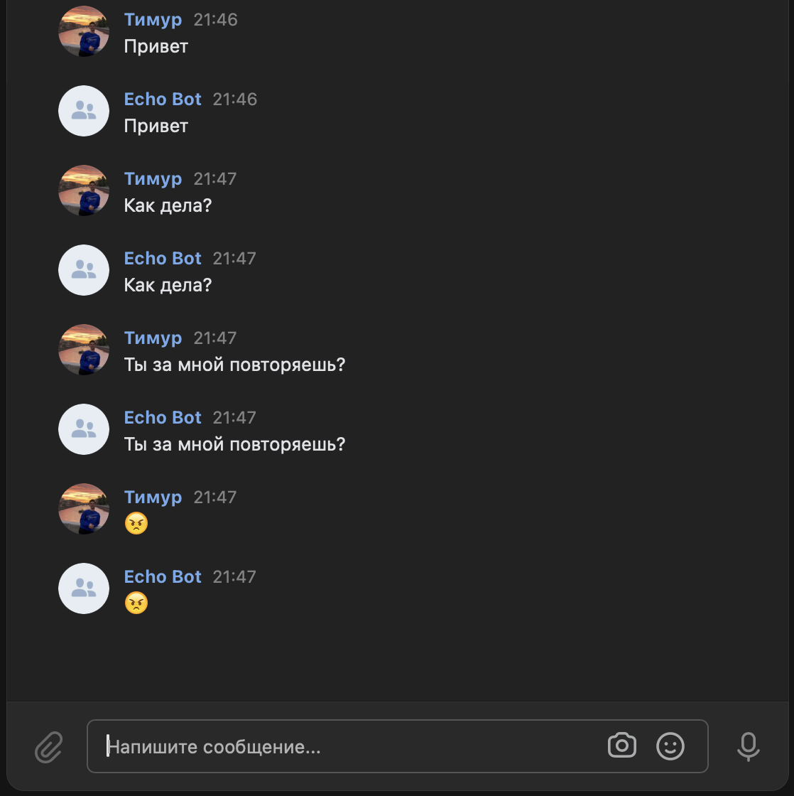
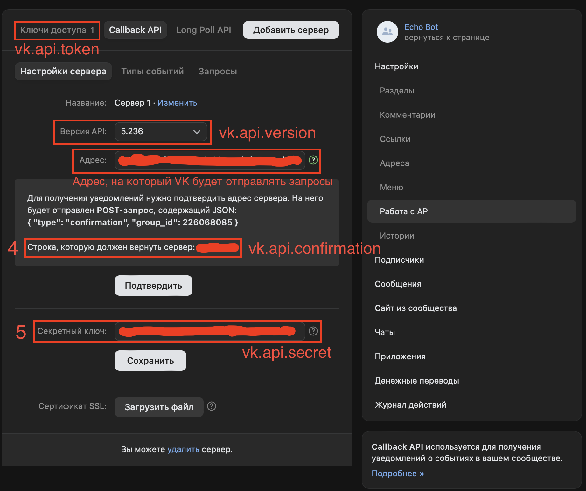

# VK Echo Bot

Проект представляет из себя бота для сообщества VK, который отвечает тем, что ему прислал пользователь.
Реализовано в рамках тестового задания для компании Just AI



[**Ознакомиться с заданием**](https://docs.google.com/document/d/1x_EEtb1AbU83dlJHVnI4GYkoSnGmXYmzqoM6q_BceF0/edit)

## Настройки сообщества VK
Как создать и настроить сообщество для работы с ботом описано в [**документации VK**](https://dev.vk.com/ru/api/bots/getting-started)
## Параметры для запуска
> | Параметр            | Описание                                 |
> |---------------------|------------------------------------------|
> | vk.api.token        | Ключ доступа VK API                      |
> | vk.api.confirmation | Строка, подтверждающая сервер для VK API |
> | vk.api.secret       | Секретный ключ VK API                    |
> | vk.api.version      | Версия VK API                            |

### Где взять параметры


## Как запустить проект
**Требования**:
* [JDK 21](https://www.oracle.com/java/technologies/downloads/#java21)
* [Apache Maven](https://maven.apache.org/download.cgi)
* Или же [Docker](https://www.docker.com/products/docker-desktop/)

### Вариант с использованием JDK
1) Склонируйте проект
```bash
git clone https://github.com/teymurosman/Vk-Echo-Bot.git
```
2) Перейдите в директорию проекта
```bash
cd Vk-Echo-Bot
```
3) Компиляция и сборка проекта
```
mvn clean package
```
4) Запустите приложение, вставив необходимые переменные окружения
```
mvn spring-boot:run \
-Dspring-boot.run.jvmArguments="-DVK_API_TOKEN=your_vk_api_token -DVK_API_VERSION=your_vk_api_version 
-DVK_API_SECRET=your_vk_api_secret -DNGROK_AUTHTOKEN=your_ngrok_authtoken"
```
Для работы с VK API можно использовать [**ngrok**](https://www.google.com/search?client=safari&rls=en&q=ngrok+download&ie=UTF-8&oe=UTF-8).
Через ngrok получаете внешний http адрес, по которому ваш сервер будет доступен, и вставляете его в настройках сообщества

### Вариант с использованием Docker
1) Склонируйте проект
```bash
git clone https://github.com/teymurosman/Vk-Echo-Bot.git
```
2) Создайте в корневой директории файл ".env" и вставьте необходимые переменные окружения в него
3) Запустите проект с помощью Docker Compose
```
docker-compose up --build
```
4) Получение адреса ngrok

После запуска, откройте веб-браузер и перейдите по адресу http://localhost:4040, чтобы увидеть внешний http адрес, выданный ngrok